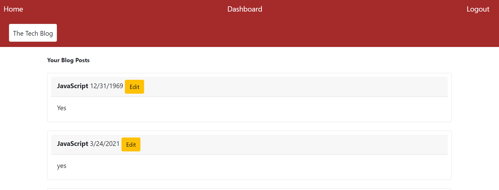

# tech-blog

## Description

The app allows us to publish posts and comment on other posts.

## Technologies Used

JavaScript, Node.js, POSTMAN, express.js, sequelize, MySQL, CSS, handlebars

## Screenshots

## Links

### Heroku

https://tech-blogger-14.herokuapp.com/

### Github Repo

https://github.com/Bryan-Thaoxaochay/tech-blog

## What I Learned

### List
1. MVC Directory 

Having the directory organized through MVC helps a lot. Although there are still a lot of files, I know where every file is.

2. Handlebars

I thought it would be difficult to link webpages in handlebars, but it may actually be easier than HTML. Having the if/else helper was helpful when deciding what needs to be displayed. Lastly, being able to do a for each in the handlebar really decreased the amount of code necessary in the JavaScript files.

3. Difficulties

I had difficulties connecting the back-end and front-end for updating, deleting, and commenting on a post. Updating and deleting was especially tricky, and I still haven't figured it out yet.

4. Modules

This is the first time using environmental variables, and keeping safe secure.

5. Routing

I am getting more use to using routes along with the methods. With the routing and JavaScript, it really makes the website much more dynamic.

6. JavaScript

I am getting use to using front-end JavaScript with the back-end routing. It was necessary for many functions, such as logging in, logout timer, and displaying the info from MySQL. Specifically, using fetch() seems really important in order to connect the routing with the JavaScript. Besides from that, it was really cool being able to create a login/signup form, and having the user logout or be logged out.

7. Helpers

A helper function made it really simple converting the date from MySQL into the correct format. However, I am still getting use to using helpers and seeing their full purpose.

8. Heroku

I learned the importance of jawsDB, and how it made my app crash a lot. It is really useful and it's importance is clear.

## Contact Information

Email: bthaoxaochay@gmail.com
GitHub: https://github.com/Bryan-Thaoxaochay 

<!-- WHEN I click on an existing blog post
THEN I am presented with the post title, contents, post creator’s username, and date created for that post and have the option to leave a comment -->

<!-- WHEN I enter a comment and click on the submit button while signed in
THEN the comment is saved and the post is updated to display the comment, the comment creator’s username, and the date created -->

<!-- WHEN I click on one of my existing posts in the dashboard
THEN I am able to delete or update my post and taken back to an updated dashboard -->
<!-- * Need to figure out how to upload clicked post onto update-delete page -->